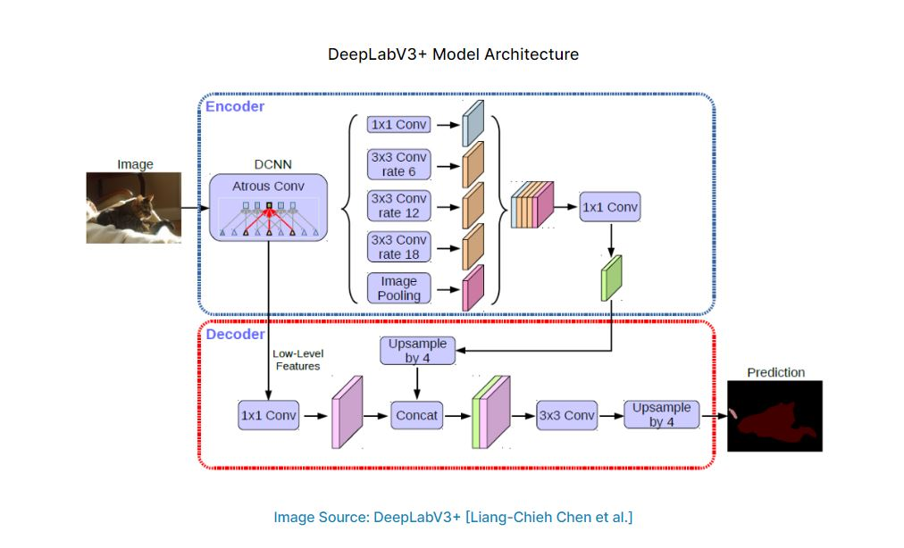

The DeepLabv3 CNN was used to segment images in the DeepGlobe dataset. It's architecture is shown below:

    

- The model has a mean IoU score of 0.7636
- The model has a mean dice loss of 0.18

## Trained Weight Files
[Sgementation Model](https://drive.google.com/drive/folders/1Pg_U7xfR5Ko2L9ZbTT0k4ysaer2Qoukf) 
