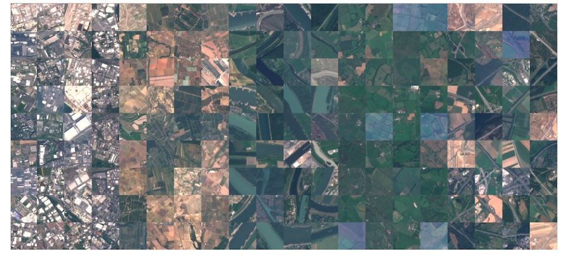
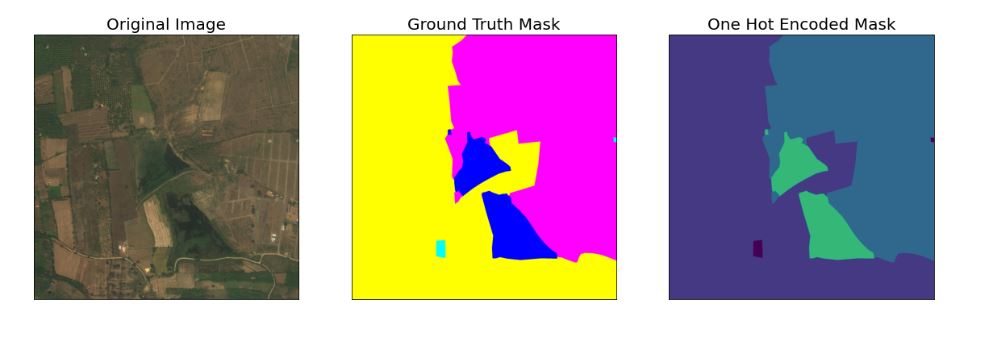

# Deep Learning Models for Land Cover Detection
This repository contains the implementation of the deep learning models used for land cover detection. Two classes of models were developed:
      
### 1. Land Cover Classification
- [Land Cover Classification](EuroSAT/) - Land cover classification models and weight files

These models are capable of classifying a satellite image into one of ten categories:
 
         Residential
         Industrial
         Highways
         Sea Lakes
         Rivers
         Herbaceous Vegetation
         Pasture
         Forest
The EuroSAT dataset was used to train the models. Three models were trained on RGB images. One model was trained on all bands of the EuroSAT dataset.

  

### 2. Land Cover Segmentation
- [Land Cover Segmentation](DeepGlobe/) - Land cover segmentation models and weight files

These model are capable of segmenting a satellite image and obtaining an image mask with colors corresponding to seven classes:
        
        Urban land: 0,255,255 - Man-made, built up areas with human artifacts
        Agriculture land: 255,255,0 - Farms, any planned plantation, cropland, orchards, vineyards.
        Rangeland: 255,0,255 - Any non-forest, non-farm, green land, grass
        Forest land: 0,255,0 - Any land with x% tree crown density plus clearcuts.
        Water: 0,0,255 - Rivers, oceans, lakes, wetland, ponds.
        Barren land: 255,255,255 - Mountain, land, rock, dessert, beach, no vegetation
        Unknown: 0,0,0 - Clouds and others
The DeepGlobe dataset was used to train the segmentation model. A state-of-the-art CNN was trained on RGB images of the DeepGlobe dataset.

  

